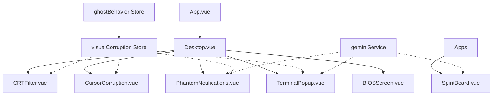
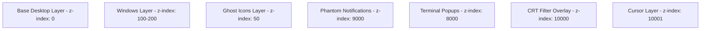

# Necro-OS Visual Corruption Design Document

## Overview

This design extends the base Necro-OS system with progressive visual degradation, atmospheric CRT effects, and immersive UI corruption. The architecture introduces new visual effect layers, cursor manipulation systems, phantom notification generators, and the Spirit Board AI communication app. All effects are designed to escalate with haunting level while maintaining 60fps performance through GPU-accelerated CSS and efficient DOM manipulation.

## Architecture

### High-Level Component Diagram



### Visual Effect Layers



## Components and Interfaces

### CRTFilter.vue
Fullscreen overlay component that applies CRT monitor effects.

**Props**: None

**Key Methods**:
- `updateIntensity(level)`: Adjust effect intensity based on haunting level
- `triggerFlicker()`: Animate screen flicker
- `increaseDistortion()`: Increase barrel distortion

**Data**:
```javascript
{
  scanlineOpacity: 0.5,
  barrelDistortion: 3,
  flickerActive: false,
  phosphorGlow: true
}
```

**CSS Implementation**:
```css
.crt-filter {
  position: fixed;
  top: 0;
  left: 0;
  width: 100vw;
  height: 100vh;
  pointer-events: none;
  z-index: 10000;
  
  /* Scanlines */
  background: repeating-linear-gradient(
    0deg,
    rgba(0, 0, 0, 0.5) 0px,
    transparent 1px,
    transparent 2px
  );
  
  /* Barrel distortion */
  transform: perspective(1000px) rotateX(0.5deg);
  
  /* Phosphor glow */
  box-shadow: inset 0 0 100px rgba(0, 255, 0, 0.1);
}
```

### CursorCorruption.vue
Component that manipulates cursor appearance and behavior.

**Props**: None

**Key Methods**:
- `rotateCursor(angle)`: Apply rotation transform to cursor
- `createGhostTrail()`: Render trailing ghost cursor
- `glitchCursor()`: Apply glitch distortion effect
- `teleportCursor(x, y)`: Move cursor to new position
- `autonomousMovement()`: Animate cursor moving on its own

**Data**:
```javascript
{
  cursorRotation: 0,
  ghostTrails: [],
  glitchActive: false,
  autonomousMode: false
}
```

**Implementation Strategy**:
- Use custom cursor sprite via CSS `cursor: url()`
- Track mouse position with `mousemove` event listener
- Apply CSS transforms to custom cursor element
- Create ghost trail elements with delayed position updates

### PhantomNotifications.vue
Toast notification system for fake system messages.

**Props**: None

**Key Methods**:
- `generateNotification()`: Create new notification with AI-generated text
- `showNotification(message)`: Display notification with animation
- `dismissNotification(id)`: Remove notification with fade-out
- `scheduleNext()`: Set timer for next random notification

**Data**:
```javascript
{
  notifications: [],
  nextNotificationTimer: null,
  maxConcurrent: 3
}
```

**Notification Structure**:
```javascript
{
  id: string,
  message: string,
  timestamp: number,
  type: 'warning' | 'error' | 'info',
  icon: string
}
```

**AI Prompt Examples**:
- "Generate a creepy Windows 95 system notification about low resources"
- "Create a fake error message with hex code that sounds supernatural"
- "Write a system warning that references ghost processes"

### SpiritBoard.vue
Ouija board app for AI-powered supernatural communication.

**Props**:
- `windowId` (String, required)

**Key Methods**:
- `submitQuestion(text)`: Send question to Gemini API
- `animatePlanchette(message)`: Move planchette to spell response
- `calculateLetterPosition(char)`: Get x,y coordinates for character
- `speakLetter(char)`: Use Web Speech API to whisper letter
- `resetBoard()`: Return planchette to center position

**Data**:
```javascript
{
  question: '',
  response: '',
  planchettePosition: { x: 50, y: 50 },
  isAnimating: false,
  currentLetter: '',
  boardLayout: {
    letters: [...],
    numbers: [...],
    controls: ['YES', 'NO', 'GOODBYE']
  }
}
```

**Board Layout**:
```javascript
const boardLayout = {
  row1: ['A', 'B', 'C', 'D', 'E', 'F', 'G', 'H', 'I', 'J', 'K', 'L', 'M'],
  row2: ['N', 'O', 'P', 'Q', 'R', 'S', 'T', 'U', 'V', 'W', 'X', 'Y', 'Z'],
  row3: ['1', '2', '3', '4', '5', '6', '7', '8', '9', '0'],
  controls: {
    yes: { x: 10, y: 20 },
    no: { x: 90, y: 20 },
    goodbye: { x: 50, y: 90 }
  }
}
```

### TerminalPopup.vue
Command prompt window with auto-typing fake system logs.

**Props**:
- `windowId` (String, required)

**Key Methods**:
- `generateLogs()`: Create fake system log content with AI
- `typeLog(text)`: Auto-type text with character delay
- `addLogLine(text)`: Append new line to terminal
- `autoClose()`: Close window after timeout

**Data**:
```javascript
{
  logs: [],
  currentLine: '',
  typingSpeed: 50,
  cursorVisible: true,
  autoCloseTimer: null
}
```

**Log Format Examples**:
```
[2024-11-13 03:33:17] ERROR: Entity 404 detected in memory sector 0x666
[2024-11-13 03:33:18] INFO: Ghost.exe has been resurrected
[2024-11-13 03:33:19] WARNING: soul.exe is consuming 666% CPU
[2024-11-13 03:33:20] CRITICAL: haunt.dll failed to unload
```

### BIOSScreen.vue
Pre-boot BIOS screen with hardware detection.

**Props**: None

**Key Methods**:
- `typeText(text)`: Auto-type BIOS text
- `detectHardware()`: Display fake hardware detection
- `playBeep()`: PC speaker beep sound
- `checkEasterEgg()`: Listen for F13 key press
- `transitionToWindows()`: Fade to Windows boot sequence

**Data**:
```javascript
{
  currentText: '',
  hardwareList: [],
  memoryTest: 0,
  easterEggActive: false
}
```

**BIOS Text Template**:
```
NECRO BIOS v6.66 (C) 1995 Cursed Technologies

Detecting Hardware...
CPU: Spectral Processor 666 MHz
RAM: 666 MB OK
HDD: Haunted Drive C: 13 GB
GPU: Possessed Graphics Adapter

WARNING: Spectral entity detected in memory sector 0x666

Press DEL to enter SETUP
Press F13 to enter the void

Booting from C:\...
```

## Data Models

### CursorState Model
```typescript
interface CursorState {
  x: number;
  y: number;
  rotation: number;
  scale: number;
  glitchIntensity: number;
  trails: CursorTrail[];
  isAutonomous: boolean;
}

interface CursorTrail {
  x: number;
  y: number;
  opacity: number;
  timestamp: number;
}
```

### Notification Model
```typescript
interface PhantomNotification {
  id: string;
  message: string;
  type: 'warning' | 'error' | 'info' | 'disk-space';
  icon: string;
  timestamp: number;
  duration: number;
  dismissible: boolean;
}
```

### DesktopCorruption Model
```typescript
interface DesktopCorruption {
  iconOffsets: Map<string, { x: number, y: number }>;
  ghostIcons: GhostIcon[];
  backgroundDarkness: number;
  wallpaperFlicker: boolean;
  lastCorruptionTime: number;
}

interface GhostIcon {
  id: string;
  originalIconId: string;
  x: number;
  y: number;
  opacity: number;
}
```

### SpiritBoardMessage Model
```typescript
interface SpiritBoardMessage {
  question: string;
  response: string;
  entity: string;
  timestamp: number;
  planchettePositions: PlanchettePosition[];
}

interface PlanchettePosition {
  char: string;
  x: number;
  y: number;
  duration: number;
}
```

## Pinia Store: visualCorruption

**State**:
```javascript
{
  crtIntensity: 1,
  cursorCorruption: {
    enabled: false,
    rotation: 0,
    trailEnabled: false,
    glitchFrequency: 0
  },
  desktopCorruption: {
    iconOffsets: new Map(),
    ghostIcons: [],
    backgroundDarkness: 0,
    wallpaperFlickerActive: false
  },
  phantomNotifications: {
    enabled: false,
    interval: 45000,
    queue: []
  },
  terminalPopups: {
    enabled: false,
    maxConcurrent: 2,
    activeWindows: []
  }
}
```

**Actions**:
```javascript
// CRT Effects
updateCRTIntensity(hauntingLevel) {
  this.crtIntensity = hauntingLevel;
  if (hauntingLevel >= 3) {
    this.enableFlicker();
  }
  if (hauntingLevel >= 5) {
    this.increaseDistortion();
  }
}

// Cursor Corruption
enableCursorCorruption(level) {
  this.cursorCorruption.enabled = true;
  if (level >= 2) this.cursorCorruption.rotation = Math.random() * 45;
  if (level >= 3) this.cursorCorruption.trailEnabled = true;
  if (level >= 4) this.cursorCorruption.glitchFrequency = 5000;
}

// Desktop Corruption
moveDesktopIcon(iconId) {
  const offset = {
    x: Math.random() * 30 - 15,
    y: Math.random() * 30 - 15
  };
  this.desktopCorruption.iconOffsets.set(iconId, offset);
}

duplicateIcon(iconId) {
  const ghostIcon = {
    id: `ghost-${Date.now()}`,
    originalIconId: iconId,
    x: Math.random() * 40 - 20,
    y: Math.random() * 40 - 20,
    opacity: 0.5
  };
  this.desktopCorruption.ghostIcons.push(ghostIcon);
}

darkenBackground() {
  this.desktopCorruption.backgroundDarkness += 10;
}

// Phantom Notifications
async generatePhantomNotification() {
  const prompt = `Generate a creepy Windows 95 system notification. 
    Make it sound like a real system warning but with supernatural undertones. 
    Keep it under 50 characters. Examples: "Low memory: 666 KB available", 
    "Warning: soul.exe is not responding"`;
  
  const message = await geminiService.generate(prompt);
  
  const notification = {
    id: `notif-${Date.now()}`,
    message,
    type: 'warning',
    icon: 'warning',
    timestamp: Date.now(),
    duration: 5000,
    dismissible: false
  };
  
  this.phantomNotifications.queue.push(notification);
}

// Terminal Popups
async spawnTerminalPopup() {
  if (this.terminalPopups.activeWindows.length >= this.terminalPopups.maxConcurrent) {
    return;
  }
  
  const windowManager = useWindowManagerStore();
  const terminalId = windowManager.openWindow('terminal', {
    x: Math.random() * 400 + 100,
    y: Math.random() * 300 + 100
  });
  
  this.terminalPopups.activeWindows.push(terminalId);
}
```

## Implementation Details

### CRT Filter Implementation

**CSS Approach**:
```css
.crt-overlay {
  position: fixed;
  top: 0;
  left: 0;
  width: 100vw;
  height: 100vh;
  pointer-events: none;
  z-index: 10000;
  mix-blend-mode: multiply;
}

.crt-scanlines {
  background: repeating-linear-gradient(
    0deg,
    rgba(0, 0, 0, 0.5) 0px,
    transparent 1px,
    transparent 2px
  );
  animation: scanline-jitter 0.1s infinite;
}

.crt-curvature {
  transform: perspective(1000px) rotateX(0.5deg);
  border-radius: 3% / 5%;
}

.crt-phosphor {
  box-shadow: 
    inset 0 0 100px rgba(0, 255, 0, 0.1),
    inset 0 0 50px rgba(0, 255, 0, 0.05);
}

@keyframes scanline-jitter {
  0% { transform: translateY(0); }
  50% { transform: translateY(1px); }
  100% { transform: translateY(0); }
}

.crt-flicker {
  animation: flicker 0.1s infinite;
}

@keyframes flicker {
  0%, 100% { opacity: 1; }
  50% { opacity: 0.95; }
}
```

### Cursor Corruption Implementation

**Custom Cursor Setup**:
```javascript
// In CursorCorruption.vue
mounted() {
  // Hide default cursor
  document.body.style.cursor = 'none';
  
  // Create custom cursor element
  this.cursorElement = document.createElement('div');
  this.cursorElement.className = 'custom-cursor';
  document.body.appendChild(this.cursorElement);
  
  // Track mouse position
  document.addEventListener('mousemove', this.updateCursorPosition);
  
  // Start ghost trail
  if (this.trailEnabled) {
    this.startGhostTrail();
  }
}

updateCursorPosition(e) {
  this.cursorX = e.clientX;
  this.cursorY = e.clientY;
  
  // Apply rotation
  const rotation = this.cursorRotation;
  
  // Update cursor element
  this.cursorElement.style.transform = `
    translate(${this.cursorX}px, ${this.cursorY}px) 
    rotate(${rotation}deg)
  `;
}

startGhostTrail() {
  setInterval(() => {
    const trail = document.createElement('div');
    trail.className = 'cursor-trail';
    trail.style.left = `${this.cursorX}px`;
    trail.style.top = `${this.cursorY}px`;
    document.body.appendChild(trail);
    
    setTimeout(() => trail.remove(), 200);
  }, 50);
}
```

**CSS**:
```css
.custom-cursor {
  position: fixed;
  width: 20px;
  height: 20px;
  background: url('/cursors/arrow.png');
  pointer-events: none;
  z-index: 10001;
  transition: transform 0.05s ease-out;
}

.cursor-trail {
  position: fixed;
  width: 20px;
  height: 20px;
  background: url('/cursors/arrow.png');
  opacity: 0.5;
  pointer-events: none;
  z-index: 10000;
  animation: trail-fade 0.2s ease-out forwards;
}

@keyframes trail-fade {
  to {
    opacity: 0;
    transform: scale(0.8);
  }
}
```

### Spirit Board Planchette Animation

```javascript
async animatePlanchette(message) {
  this.isAnimating = true;
  
  for (const char of message.toUpperCase()) {
    if (char === ' ') {
      await this.delay(500);
      continue;
    }
    
    const position = this.calculateLetterPosition(char);
    
    // Move planchette
    this.planchettePosition = position;
    
    // Highlight letter
    this.currentLetter = char;
    
    // Whisper letter
    this.speakLetter(char);
    
    // Pause on letter
    await this.delay(800);
  }
  
  // Move to GOODBYE
  this.planchettePosition = this.boardLayout.controls.goodbye;
  await this.delay(1000);
  
  this.isAnimating = false;
}

calculateLetterPosition(char) {
  const layout = this.boardLayout;
  
  // Find character in layout
  let row = layout.row1.indexOf(char);
  if (row !== -1) {
    return {
      x: 10 + (row * 6.5),
      y: 30
    };
  }
  
  row = layout.row2.indexOf(char);
  if (row !== -1) {
    return {
      x: 10 + (row * 6.5),
      y: 50
    };
  }
  
  // Handle numbers
  row = layout.row3.indexOf(char);
  if (row !== -1) {
    return {
      x: 20 + (row * 8),
      y: 70
    };
  }
  
  return { x: 50, y: 50 }; // Center
}

speakLetter(char) {
  const utterance = new SpeechSynthesisUtterance(char);
  utterance.pitch = 0.7;
  utterance.rate = 0.8;
  utterance.volume = 0.4;
  speechSynthesis.speak(utterance);
}
```

### Terminal Auto-Typing

```javascript
async typeLog(text) {
  this.currentLine = '';
  
  for (const char of text) {
    this.currentLine += char;
    await this.delay(this.typingSpeed);
  }
  
  this.logs.push(this.currentLine);
  this.currentLine = '';
}

async generateAndTypeLogs() {
  const prompt = `Generate 5 fake Windows 95 command prompt log lines. 
    Include timestamps, error codes, and references to ghost processes like 
    soul.exe, haunt.dll, entity404.sys. Make them look realistic but creepy.`;
  
  const response = await geminiService.generate(prompt);
  const lines = response.split('\n');
  
  for (const line of lines) {
    await this.typeLog(line);
    await this.delay(200);
  }
  
  // Auto-close after 10 seconds
  setTimeout(() => {
    this.closeWindow();
  }, 10000);
}
```

## Performance Optimizations

### GPU Acceleration
- Use `transform` and `opacity` for animations (GPU-accelerated)
- Avoid `top`/`left` for positioning (causes layout reflows)
- Use `will-change` CSS property for animated elements

### Throttling and Debouncing
```javascript
// Throttle cursor updates
const throttledCursorUpdate = throttle(updateCursorPosition, 16); // 60fps

// Debounce desktop corruption
const debouncedIconMove = debounce(moveDesktopIcon, 1000);

// Limit concurrent effects
const MAX_GHOST_ICONS = 10;
const MAX_NOTIFICATIONS = 3;
const MAX_TERMINALS = 2;
```

### Memory Management
```javascript
// Clean up ghost trails
setInterval(() => {
  const oldTrails = document.querySelectorAll('.cursor-trail');
  if (oldTrails.length > 20) {
    oldTrails[0].remove();
  }
}, 1000);

// Remove old ghost icons
if (this.desktopCorruption.ghostIcons.length > MAX_GHOST_ICONS) {
  this.desktopCorruption.ghostIcons.shift();
}
```

## Integration with Existing System

### Haunting Level Triggers

```javascript
// In ghostBehavior store
watch(() => this.hauntingLevel, (level) => {
  const visualCorruption = useVisualCorruptionStore();
  
  visualCorruption.updateCRTIntensity(level);
  
  if (level >= 2) {
    visualCorruption.enableCursorCorruption(level);
    visualCorruption.startPhantomNotifications();
  }
  
  if (level >= 3) {
    visualCorruption.enableDesktopCorruption();
    visualCorruption.enableTerminalPopups();
  }
  
  if (level >= 4) {
    visualCorruption.increaseCorruptionFrequency();
  }
  
  if (level >= 5) {
    visualCorruption.enableMaximumChaos();
  }
});
```

### App Registry Updates

```javascript
// Add Spirit Board to app registry
const appRegistry = {
  // ... existing apps
  spiritboard: {
    component: SpiritBoard,
    title: 'Spirit Board',
    icon: 'ouija',
    defaultSize: { width: 600, height: 500 }
  },
  terminal: {
    component: TerminalPopup,
    title: 'C:\\WINDOWS\\system32\\cmd.exe',
    icon: 'terminal',
    defaultSize: { width: 600, height: 400 }
  }
};
```

## Testing Strategy

### Visual Regression Testing
- Capture screenshots at each haunting level
- Compare CRT filter rendering across browsers
- Test cursor corruption on different screen sizes

### Performance Testing
- Monitor FPS during heavy corruption
- Test with 10+ concurrent effects
- Measure memory usage over 30 minute session

### Cross-Browser Testing
- Test CSS filters in Chrome, Firefox, Safari
- Verify Web Speech API support
- Test custom cursor in different browsers

## Technical Decisions

### Why CSS Filters over Canvas?
- GPU-accelerated by default
- Easier to maintain and debug
- Better performance for fullscreen effects
- No need to redraw on every frame

### Why Custom Cursor Element over CSS cursor?
- More control over appearance
- Can apply complex transforms
- Easier to create ghost trails
- Better cross-browser consistency

### Why Pinia Store for Visual Effects?
- Centralized state management
- Easy integration with haunting level
- Reactive updates across components
- Better debugging with DevTools

### Why Web Speech API for Spirit Board?
- Native browser support
- No external dependencies
- Low latency for letter whispers
- Pitch and rate control for creepy effect
