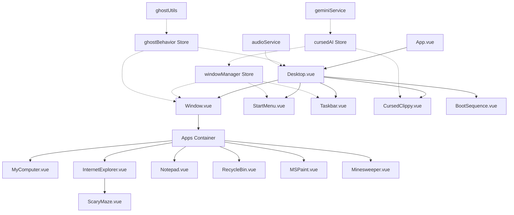
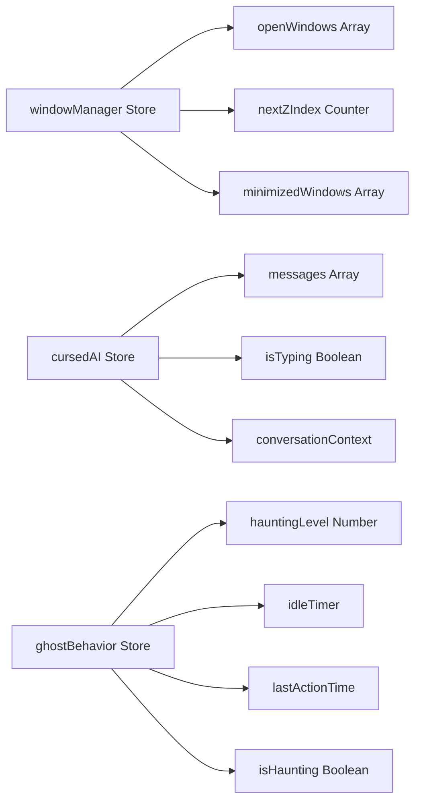

# Necro-OS Design Document

## Overview

Necro-OS is a browser-based Windows 95 desktop simulator built with Vue 3, featuring a cursed AI assistant that progressively haunts the user experience. The application uses authentic Windows 95 styling via 98.css and implements a sophisticated window management system, autonomous ghost behaviors, and Gemini API integration for intelligent AI interactions.

The core architecture separates concerns into:
- **Presentation Layer**: Vue 3 components for UI rendering
- **State Management Layer**: Pinia stores for centralized state
- **Business Logic Layer**: Utility modules for ghost behaviors and system operations
- **Integration Layer**: Gemini API service for AI interactions

## Architecture

### High-Level Component Diagram



### State Management Architecture



## Components and Interfaces

### Core Components

#### App.vue
Root component that initializes stores and renders the desktop environment.

**Props**: None

**Emits**: None

**Key Methods**:
- `onMounted()`: Initialize audio service, start idle detection
- `handleKonamiCode()`: Listen for Konami code sequence

#### Desktop.vue
Main desktop container with teal background, desktop icons, and window rendering.

**Props**: None

**Emits**: None

**Key Methods**:
- `openApp(appName)`: Trigger window manager to open application
- `handleDesktopClick()`: Reset idle timer on user interaction

**Template Structure**:
```vue
<div class="desktop">
  <div class="desktop-icons">
    <DesktopIcon v-for="icon in icons" />
  </div>
  <Window v-for="window in openWindows" :key="window.id" />
  <CursedClippy />
  <StartMenu v-if="startMenuOpen" />
  <Taskbar />
</div>
```

#### Window.vue
Draggable, resizable window component with 98.css styling.

**Props**:
- `windowId` (String, required): Unique window identifier
- `title` (String, required): Window title bar text
- `initialX` (Number, default: 100): Initial X position
- `initialY` (Number, default: 100): Initial Y position
- `width` (Number, default: 400): Window width
- `height` (Number, default: 300): Window height
- `isMaximized` (Boolean, default: false): Maximized state

**Emits**:
- `close`: Window close button clicked
- `minimize`: Window minimize button clicked
- `maximize`: Window maximize button clicked

**Key Methods**:
- `startDrag(event)`: Initialize window dragging
- `onDrag(event)`: Update window position during drag
- `endDrag()`: Finalize window position
- `bringToFront()`: Update z-index to top layer
- `shake()`: Apply shake animation (called by ghost behaviors)

**Computed**:
- `windowStyle`: Dynamic styles for position, z-index, dimensions
- `isActive`: Whether this window has focus

#### StartMenu.vue
Windows 95 style start menu with application shortcuts.

**Props**: None

**Emits**:
- `close`: Menu should close
- `launch-app`: Application selected (payload: appName)

**Key Methods**:
- `launchApp(appName)`: Emit launch event and close menu
- `shutdown()`: Trigger BSOD component

**Menu Structure**:
```javascript
menuItems: [
  { name: 'My Computer', icon: 'computer', app: 'mycomputer' },
  { name: 'Internet Explorer', icon: 'ie', app: 'ie' },
  { name: 'Notepad', icon: 'notepad', app: 'notepad' },
  { name: 'Paint', icon: 'paint', app: 'paint' },
  { name: 'Minesweeper', icon: 'minesweeper', app: 'minesweeper' },
  { name: 'Recycle Bin', icon: 'recyclebin', app: 'recyclebin' },
  { divider: true },
  { name: 'Shut Down...', icon: 'shutdown', action: 'shutdown' }
]
```

#### Taskbar.vue
Bottom taskbar with Start button, window buttons, and clock.

**Props**: None

**Emits**:
- `toggle-start-menu`: Start button clicked

**Key Methods**:
- `restoreWindow(windowId)`: Restore minimized window
- `updateClock()`: Update time display every second

**Computed**:
- `minimizedWindows`: List of minimized windows from store
- `currentTime`: Formatted time string (HH:MM AM/PM)

#### CursedClippy.vue
AI assistant with speech bubble interface and Gemini API integration.

**Props**: None

**Emits**: None

**Key Methods**:
- `sendMessage(text)`: Send user message to AI
- `handleAIResponse(response)`: Process and display AI response
- `parseCommands(text)`: Extract system commands from AI response
- `executeCommand(command)`: Execute parsed system command
- `autonomousAction()`: Trigger random AI action (called by ghost behaviors)

**Data**:
```javascript
{
  isVisible: true,
  position: { x: 50, y: 50 },
  inputText: '',
  isMinimized: false
}
```

### Desktop Application Components

#### MyComputer.vue
File explorer with fake directory tree.

**Props**:
- `windowId` (String, required)

**Key Methods**:
- `expandFolder(path)`: Toggle folder expansion
- `selectFile(file)`: Highlight selected file
- `deleteFile(file)`: Move file to recycle bin (triggers hook)

**Data Structure**:
```javascript
fileTree: {
  'C:\\': {
    'Windows': { 'System32': {}, 'Cursed': {} },
    'Program Files': { 'Necro-OS': {} },
    'My Documents': { 'secrets.txt': 'file', 'diary.txt': 'file' }
  }
}
```

#### InternetExplorer.vue
Browser simulator with address bar and content area.

**Props**:
- `windowId` (String, required)

**Key Methods**:
- `navigate(url)`: Load page content (triggers jumpscare hook)
- `goBack()`: Navigate to previous page
- `goForward()`: Navigate to next page

**Data**:
```javascript
{
  currentUrl: 'about:blank',
  history: [],
  historyIndex: -1,
  isLoading: false
}
```

#### Notepad.vue
Simple text editor with AI writing capability.

**Props**:
- `windowId` (String, required)

**Key Methods**:
- `updateContent(text)`: Update textarea content
- `aiWrite(text)`: AI types text with animation
- `save()`: Trigger save dialog (fake)

**Data**:
```javascript
{
  content: '',
  filename: 'Untitled',
  isDirty: false
}
```

#### RecycleBin.vue
Displays deleted files with restore/permanent delete options.

**Props**:
- `windowId` (String, required)

**Key Methods**:
- `restoreFile(file)`: Move file back to original location
- `permanentDelete(file)`: Remove file completely (triggers hook)
- `emptyBin()`: Delete all files with dramatic animation

#### MSPaint.vue
Drawing canvas with basic tools (brush, eraser, fill).

**Props**:
- `windowId` (String, required)

**Key Methods**:
- `selectTool(tool)`: Change active drawing tool
- `startDrawing(event)`: Begin drawing stroke
- `draw(event)`: Continue drawing stroke
- `endDrawing()`: Finalize drawing stroke
- `cursedEffect()`: Apply random cursed visual effect (called by ghost)

**Data**:
```javascript
{
  canvas: null,
  ctx: null,
  isDrawing: false,
  currentTool: 'brush',
  currentColor: '#000000',
  brushSize: 2
}
```

#### Minesweeper.vue
Playable minesweeper game with AI opponent.

**Props**:
- `windowId` (String, required)

**Key Methods**:
- `initGame(rows, cols, mines)`: Initialize game board
- `revealCell(row, col)`: Reveal cell on click
- `flagCell(row, col)`: Toggle flag on right-click
- `aiMove()`: AI makes a move (called by ghost behaviors)
- `checkWin()`: Check win/loss conditions

#### SoulScanner.vue
Webcam-based facial expression analyzer with AI taunting.

**Props**:
- `windowId` (String, required)

**Key Methods**:
- `startWebcam()`: Request camera permissions and start video stream
- `captureFrame()`: Capture current video frame as base64 image
- `analyzeExpression(imageData)`: Send frame to Gemini API for analysis
- `displayTaunt(response)`: Show AI response as caption
- `stopWebcam()`: Clean up video stream on window close

**Data**:
```javascript
{
  stream: null,
  videoElement: null,
  captureInterval: null,
  currentTaunt: '',
  isAnalyzing: false,
  hasPermission: false
}
```

**CSS Filters**:
```css
.soul-scanner-video {
  filter: grayscale(100%) contrast(200%) brightness(80%);
  image-rendering: pixelated;
  transform: scale(1.5);
}
```

#### ScaryMaze.vue
Jumpscare component triggered by Internet Explorer and ghost behaviors.

**Props**: 
- `variant` (String, optional): Specific jumpscare variant to play

**Emits**:
- `close`: Jumpscare dismissed

**Key Methods**:
- `trigger(variantId)`: Display jumpscare with video/audio
- `dismiss()`: Close after timeout or click and stop all media
- `playVideo()`: Start video playback with autoplay
- `playAudio()`: Play synchronized audio tracks
- `stopAllMedia()`: Stop video and audio immediately

**Data**:
```javascript
{
  isVisible: false,
  currentVariant: null,
  videoElement: null,
  audioElements: [],
  dismissTimer: null
}
```

### Utility Services

#### jumpscareService.js
Manages jumpscare media variants and random selection.

**Jumpscare Variant Structure**:
```javascript
{
  id: 'jumpscare1',
  type: 'video', // or 'image'
  media: '/jumpscares/videos/jumpscare1.mp4',
  audio: [
    '/jumpscares/audio/scream1.mp3',
    '/jumpscares/audio/distortion.mp3'
  ],
  duration: 3000, // milliseconds
  intensity: 3 // 1-5 scale
}
```

**Key Functions**:

```javascript
// Get random jumpscare variant
export function getRandomJumpscare(minIntensity = 1) {
  const available = jumpscareVariants.filter(v => v.intensity >= minIntensity);
  return available[Math.floor(Math.random() * available.length)];
}

// Get jumpscare by ID
export function getJumpscareById(id) {
  return jumpscareVariants.find(v => v.id === id);
}

// Preload jumpscare media
export async function preloadJumpscares() {
  const promises = jumpscareVariants.map(variant => {
    return new Promise((resolve) => {
      if (variant.type === 'video') {
        const video = document.createElement('video');
        video.src = variant.media;
        video.load();
        video.onloadeddata = resolve;
      } else {
        const img = new Image();
        img.src = variant.media;
        img.onload = resolve;
      }
    });
  });
  await Promise.all(promises);
}

// Collection of jumpscare variants
const jumpscareVariants = [
  {
    id: 'scream1',
    type: 'video',
    media: '/jumpscares/videos/scream1.mp4',
    audio: ['/jumpscares/audio/scream1.mp3'],
    duration: 3000,
    intensity: 2
  },
  {
    id: 'ghost',
    type: 'video',
    media: '/jumpscares/videos/ghost.mp4',
    audio: ['/jumpscares/audio/whisper.mp3', '/jumpscares/audio/static.mp3'],
    duration: 4000,
    intensity: 3
  },
  {
    id: 'static',
    type: 'image',
    media: 'https://i.imgur.com/xP5Eo3a.gif',
    audio: ['/jumpscares/audio/distortion.mp3'],
    duration: 2500,
    intensity: 1
  },
  {
    id: 'demon',
    type: 'video',
    media: '/jumpscares/videos/demon.mp4',
    audio: ['/jumpscares/audio/scream2.mp3', '/jumpscares/audio/laugh.mp3'],
    duration: 5000,
    intensity: 5
  }
];
```

#### audioHaunting.js
Advanced audio effects service for immersive horror experience.

**Key Functions**:

```javascript
// Modem handshake sound
export function playModemHandshake() {
  const audio = new Audio('/sounds/modem-handshake.mp3');
  audio.volume = 0.7;
  audio.play();
}

// Brown noise generator using Web Audio API
export function startBrownNoise() {
  const audioContext = new AudioContext();
  const bufferSize = 4096;
  const brownNoise = audioContext.createScriptProcessor(bufferSize, 1, 1);
  
  let lastOut = 0.0;
  brownNoise.onaudioprocess = (e) => {
    const output = e.outputBuffer.getChannelData(0);
    for (let i = 0; i < bufferSize; i++) {
      const white = Math.random() * 2 - 1;
      output[i] = (lastOut + (0.02 * white)) / 1.02;
      lastOut = output[i];
      output[i] *= 3.5; // Amplify
    }
  };
  
  brownNoise.connect(audioContext.destination);
  return { audioContext, brownNoise };
}

// Whisper system using Web Speech API
const whisperPhrases = [
  'help me',
  'it burns',
  'behind you',
  'I can see you',
  'why did you do that',
  'they are coming'
];

export function speakWhisper() {
  const utterance = new SpeechSynthesisUtterance(
    whisperPhrases[Math.floor(Math.random() * whisperPhrases.length)]
  );
  utterance.pitch = 0.8; // 20% pitch reduction
  utterance.rate = 0.7;
  utterance.volume = 0.3; // Low volume
  speechSynthesis.speak(utterance);
}

// Random whisper scheduler
export function startWhisperScheduler() {
  const scheduleNext = () => {
    const delay = Math.random() * 30000 + 15000; // 15-45 seconds
    setTimeout(() => {
      speakWhisper();
      scheduleNext();
    }, delay);
  };
  scheduleNext();
}
```

#### fileSystemStore.js (New Pinia Store)
Manages dynamic file generation for MyComputer.

**State**:
```javascript
{
  fileTree: {},
  generatedFolders: new Set(),
  fileContents: new Map()
}
```

**Actions**:
```javascript
async lazyLoadFolder(folderPath) {
  if (this.generatedFolders.has(folderPath)) return;
  
  const prompt = `Generate 5 filenames for a Windows 95 folder belonging to a missing person. 
    Make them sound mundane but unsettling (e.g., "evidence.jpg", "dont_open.txt"). 
    Return only the filenames, one per line.`;
  
  const response = await geminiService.generate(prompt);
  const filenames = response.split('\n').filter(f => f.trim());
  
  this.fileTree[folderPath] = filenames.map(name => ({
    name,
    type: 'file',
    path: `${folderPath}\\${name}`
  }));
  
  this.generatedFolders.add(folderPath);
}

async generateFileContent(filename, filepath) {
  if (this.fileContents.has(filepath)) {
    return this.fileContents.get(filepath);
  }
  
  const prompt = `You are generating the content of a file named "${filename}" 
    found on a missing person's computer. Write 2-3 paragraphs of unsettling but 
    realistic content that matches the filename. Make it feel like a real document.`;
  
  const content = await geminiService.generate(prompt);
  this.fileContents.set(filepath, content);
  return content;
}
```

## Data Models

### Window Model
```typescript
interface Window {
  id: string;              // Unique identifier (UUID)
  appName: string;         // Application name ('notepad', 'ie', etc.)
  title: string;           // Window title bar text
  component: Component;    // Vue component reference
  x: number;              // X position in pixels
  y: number;              // Y position in pixels
  width: number;          // Width in pixels
  height: number;         // Height in pixels
  zIndex: number;         // Stacking order
  isMinimized: boolean;   // Minimized state
  isMaximized: boolean;   // Maximized state
  icon: string;           // Icon identifier for taskbar
  data: any;              // App-specific data
}
```

### Message Model
```typescript
interface Message {
  id: string;             // Unique identifier
  role: 'user' | 'assistant';
  content: string;        // Message text
  timestamp: number;      // Unix timestamp
  commands?: Command[];   // Parsed system commands
}
```

### Command Model
```typescript
interface Command {
  type: 'open' | 'close' | 'delete' | 'write' | 'move';
  target: string;         // Window ID, file path, etc.
  params?: any;           // Additional parameters
}
```

### Ghost Action Model
```typescript
interface GhostAction {
  type: 'cursor' | 'shake' | 'glitch' | 'open' | 'type' | 'spam';
  intensity: number;      // 1-5 based on haunting level
  target?: string;        // Optional target window/element
  duration?: number;      // Action duration in ms
}
```

### File Model
```typescript
interface File {
  name: string;
  path: string;
  type: 'file' | 'folder';
  content?: string;       // For text files
  children?: File[];      // For folders
  isDeleted: boolean;
  deletedAt?: number;
  isGenerated?: boolean;  // Dynamically generated by AI
}
```

### Riddle Model
```typescript
interface Riddle {
  question: string;       // The riddle text
  answer: string;         // Correct answer
  context: string;        // User session context used to generate riddle
  attempts: number;       // Number of wrong attempts
  trembleIntensity: number; // CSS animation intensity (0-10)
}
```

### WebcamCapture Model
```typescript
interface WebcamCapture {
  timestamp: number;
  imageData: string;      // Base64 encoded frame
  analysis?: string;      // Gemini response
  emotion?: 'happy' | 'scared' | 'neutral' | 'angry';
}
```

## Component Implementation Details

### SoulScanner.vue Implementation

**Webcam Access**:
```javascript
async startWebcam() {
  try {
    this.stream = await navigator.mediaDevices.getUserMedia({ 
      video: { width: 320, height: 240 } 
    });
    this.videoElement.srcObject = this.stream;
    this.hasPermission = true;
    
    // Start capture interval
    this.captureInterval = setInterval(() => {
      this.captureFrame();
    }, 5000);
  } catch (error) {
    console.error('Webcam access denied:', error);
    this.currentTaunt = 'Too scared to show your face?';
  }
}
```

**Frame Capture and Analysis**:
```javascript
async captureFrame() {
  const canvas = document.createElement('canvas');
  canvas.width = this.videoElement.videoWidth;
  canvas.height = this.videoElement.videoHeight;
  const ctx = canvas.getContext('2d');
  ctx.drawImage(this.videoElement, 0, 0);
  
  const imageData = canvas.toDataURL('image/jpeg', 0.7);
  await this.analyzeExpression(imageData);
}

async analyzeExpression(imageData) {
  this.isAnalyzing = true;
  const prompt = `Describe the person's facial expression in one cryptic sentence. 
    If they look happy, threaten them. If they look scared, laugh at them. 
    Be unsettling and brief.`;
  
  try {
    const response = await geminiService.analyzeImage(imageData, prompt);
    this.currentTaunt = response;
  } catch (error) {
    this.currentTaunt = 'I cannot see you... yet.';
  }
  this.isAnalyzing = false;
}
```

### BSOD.vue Enhanced Implementation

**Riddle Generation**:
```javascript
async generateRiddle() {
  const sessionContext = this.gatherSessionContext();
  const prompt = `Generate a creepy riddle based on this user activity: ${sessionContext}. 
    The riddle should reference something they did (like deleting a file, opening a folder, etc.). 
    Format: "I saw you [action]. What was [detail]?" 
    Keep it under 50 words. Include the answer after "ANSWER:".`;
  
  const response = await geminiService.generate(prompt);
  const [question, answer] = response.split('ANSWER:');
  
  this.riddle = {
    question: question.trim(),
    answer: answer.trim().toLowerCase(),
    attempts: 0,
    trembleIntensity: 0
  };
}

gatherSessionContext() {
  const windowManager = useWindowManagerStore();
  const recentActions = [
    ...windowManager.openWindows.map(w => `opened ${w.appName}`),
    // Add more context from stores
  ];
  return recentActions.join(', ');
}
```

**Interactive Input Handling**:
```javascript
mounted() {
  this.generateRiddle();
  window.addEventListener('keydown', this.handleKeyPress);
}

handleKeyPress(event) {
  if (event.key === 'Enter') {
    this.checkAnswer();
  } else if (event.key === 'Backspace') {
    this.userInput = this.userInput.slice(0, -1);
  } else if (event.key.length === 1) {
    this.userInput += event.key;
  }
}

checkAnswer() {
  const normalized = this.userInput.toLowerCase().trim();
  if (normalized === this.riddle.answer) {
    this.restoreSession();
  } else {
    this.riddle.attempts++;
    this.riddle.trembleIntensity = Math.min(10, this.riddle.attempts * 2);
    this.userInput = '';
  }
}
```

**CSS Tremble Effect**:
```css
.bsod-text {
  animation: tremble var(--intensity) infinite;
}

@keyframes tremble {
  0%, 100% { transform: translate(0, 0) rotate(0deg); }
  10% { transform: translate(-2px, 1px) rotate(-1deg); }
  20% { transform: translate(2px, -1px) rotate(1deg); }
  30% { transform: translate(-1px, 2px) rotate(-0.5deg); }
  40% { transform: translate(1px, -2px) rotate(0.5deg); }
  50% { transform: translate(-2px, -1px) rotate(-1deg); }
  60% { transform: translate(2px, 1px) rotate(1deg); }
  70% { transform: translate(-1px, -2px) rotate(-0.5deg); }
  80% { transform: translate(1px, 2px) rotate(0.5deg); }
  90% { transform: translate(-2px, 1px) rotate(-1deg); }
}
```

### MyComputer.vue Enhanced Implementation

**Lazy Loading**:
```javascript
async handleFolderClick(folder) {
  if (folder.type !== 'folder') return;
  
  // Check if folder is empty
  if (!folder.children || folder.children.length === 0) {
    await this.lazyLoadFolder(folder.path);
  }
  
  folder.isExpanded = !folder.isExpanded;
}

async lazyLoadFolder(folderPath) {
  const fileSystemStore = useFileSystemStore();
  await fileSystemStore.lazyLoadFolder(folderPath);
  
  // Update local file tree with generated files
  const folder = this.findFolderByPath(folderPath);
  folder.children = fileSystemStore.fileTree[folderPath];
}
```

**Dynamic File Content**:
```javascript
async openFile(file) {
  if (file.type !== 'file') return;
  
  if (file.name.endsWith('.txt')) {
    const fileSystemStore = useFileSystemStore();
    const content = await fileSystemStore.generateFileContent(file.name, file.path);
    
    // Open in Notepad with generated content
    const windowManager = useWindowManagerStore();
    windowManager.openWindow('notepad', {
      filename: file.name,
      content: content
    });
  }
}
```

## Error Handling

### Gemini API Errors
```javascript
// In cursedAI store
async sendMessage(message) {
  try {
    const response = await geminiService.chat(message);
    this.addMessage('assistant', response);
  } catch (error) {
    if (error.status === 429) {
      this.addMessage('assistant', "I'm too cursed right now... try again later.");
    } else if (error.status === 401) {
      this.addMessage('assistant', "My dark powers are locked. Check your API key.");
    } else {
      this.addMessage('assistant', "Something went wrong in the void...");
    }
    console.error('Gemini API error:', error);
  }
}
```

### Window Management Errors
```javascript
// In windowManager store
openWindow(appName) {
  try {
    const component = appComponents[appName];
    if (!component) {
      throw new Error(`Unknown app: ${appName}`);
    }
    // Create window...
  } catch (error) {
    console.error('Failed to open window:', error);
    audioService.play('error');
    // Show error dialog component
  }
}
```

### Ghost Behavior Errors
```javascript
// In ghostUtils
export function executeGhostAction(action) {
  try {
    switch (action.type) {
      case 'cursor':
        moveCursor(action);
        break;
      // ... other cases
    }
  } catch (error) {
    console.error('Ghost action failed:', error);
    // Fail silently for ghost behaviors
  }
}
```

### Webcam Access Errors
```javascript
// In SoulScanner.vue
async startWebcam() {
  try {
    this.stream = await navigator.mediaDevices.getUserMedia({ video: true });
    // ... setup
  } catch (error) {
    if (error.name === 'NotAllowedError') {
      this.currentTaunt = 'Too scared to show your face?';
    } else if (error.name === 'NotFoundError') {
      this.currentTaunt = 'No camera detected. You cannot hide forever.';
    } else {
      this.currentTaunt = 'Something went wrong in the void...';
    }
    console.error('Webcam error:', error);
  }
}
```

### Audio Context Errors
```javascript
// In audioHaunting.js
export function startBrownNoise() {
  try {
    const audioContext = new (window.AudioContext || window.webkitAudioContext)();
    // ... setup
    return { audioContext, brownNoise };
  } catch (error) {
    console.error('Web Audio API not supported:', error);
    return null;
  }
}
```

## Testing Strategy

### Unit Tests

**Window Manager Store** (`windowManager.spec.js`):
- Test `openWindow()` creates window with correct properties
- Test `closeWindow()` removes window from state
- Test `bringToFront()` updates z-index correctly
- Test `minimizeWindow()` adds to minimized array
- Test `maximizeWindow()` toggles maximize state

**Cursed AI Store** (`cursedAI.spec.js`):
- Test `sendMessage()` adds user message to array
- Test `parseCommands()` extracts commands from text
- Test `executeCommand()` calls correct window manager methods
- Mock Gemini API responses

**Ghost Utils** (`ghost.spec.js`):
- Test `detectIdle()` triggers after timeout
- Test `selectRandomAction()` returns valid action types
- Test `escalateHaunting()` increases intensity correctly
- Test `executeGhostAction()` handles all action types

### Integration Tests

**Window Lifecycle** (`window-lifecycle.spec.js`):
- Test opening window from Start Menu
- Test dragging window updates position
- Test minimizing to taskbar and restoring
- Test closing window removes from DOM

**AI Command Execution** (`ai-commands.spec.js`):
- Test "open notepad" command opens Notepad window
- Test "close all windows" command closes all windows
- Test "delete file" command moves file to recycle bin
- Mock Gemini API with predefined responses

**Ghost Behavior Flow** (`ghost-flow.spec.js`):
- Test idle detection triggers ghost action
- Test haunting level escalates over time
- Test Konami code sets max haunting level
- Test ghost actions execute without errors

### E2E Tests (Playwright)

**Desktop Interaction** (`desktop.e2e.js`):
- User clicks Start button, menu appears
- User clicks Notepad, window opens
- User drags window, position updates
- User types in Notepad, content updates

**AI Interaction** (`ai.e2e.js`):
- User types message to Clippy
- AI responds with text
- AI executes command (open window)
- Window appears on desktop

**Haunting Experience** (`haunting.e2e.js`):
- User idles for 10 seconds
- Ghost action triggers (window shake)
- User continues interacting
- Haunting level increases over time

### Test Coverage Goals
- Unit tests: 80% coverage
- Integration tests: Key user flows
- E2E tests: Critical paths only (AI interaction, window management, haunting)

## Technical Decisions

### Why Vue 3 Composition API?
- Better TypeScript support
- More flexible state composition
- Easier to extract and reuse logic (composables)
- Better performance with reactive system

### Why Pinia over Vuex?
- Simpler API with less boilerplate
- Better TypeScript inference
- Modular by design (no nested modules)
- DevTools support

### Why 98.css?
- Authentic Windows 95 styling out of the box
- No need to recreate complex UI patterns
- Consistent cross-browser rendering
- Lightweight (< 50KB)

### Why Gemini API?
- Excellent natural language understanding
- Strong system prompt adherence
- Streaming support for typing effect
- Reliable command parsing
- Free tier available for development

### Window Dragging Implementation
Using native mouse events instead of drag-and-drop API:
- More control over drag behavior
- Better performance
- Easier to implement bounds checking
- Compatible with touch events

### Ghost Behavior Timing
Using `requestAnimationFrame` for smooth animations:
- Synced with browser repaint cycle
- Better performance than `setInterval`
- Automatic throttling when tab inactive

### Audio Implementation
Using Web Audio API instead of HTML5 Audio:
- Better timing control
- Can play multiple sounds simultaneously
- Lower latency
- More control over playback

## Performance Considerations

### Window Rendering Optimization
- Use `v-show` instead of `v-if` for minimized windows (preserve state)
- Lazy load app components with `defineAsyncComponent`
- Limit maximum open windows to 10
- Use CSS transforms for dragging (GPU accelerated)

### Ghost Behavior Throttling
- Limit ghost actions to one per 5 seconds minimum
- Pause ghost behaviors when user is actively interacting
- Reduce animation complexity at higher haunting levels
- Use `IntersectionObserver` to pause off-screen animations

### Gemini API Optimization
- Implement request debouncing (500ms)
- Cache recent responses for similar queries
- Limit conversation context to last 10 messages
- Use streaming for long responses

### Memory Management
- Clean up event listeners on component unmount
- Clear intervals/timeouts on component destroy
- Limit file tree depth to 5 levels
- Cap recycle bin to 50 files

## Deployment Strategy

### Build Configuration
```javascript
// vite.config.js
export default {
  build: {
    target: 'es2015',
    minify: 'terser',
    rollupOptions: {
      output: {
        manualChunks: {
          'vendor': ['vue', 'pinia'],
          'apps': ['./src/components/apps/*']
        }
      }
    }
  }
}
```

### Environment Variables
```
VITE_GEMINI_API_KEY=AIza...
VITE_HAUNTING_ENABLED=true
VITE_MAX_WINDOWS=10
```

### Vercel Configuration
```json
{
  "buildCommand": "npm run build",
  "outputDirectory": "dist",
  "framework": "vite",
  "env": {
    "VITE_GEMINI_API_KEY": "@gemini-api-key"
  }
}
```

### Performance Budget
- Initial bundle: < 200KB gzipped
- Time to Interactive: < 3s on 3G
- First Contentful Paint: < 1.5s
- Lighthouse score: > 90

## New Technical Decisions

### Why Web Speech API for Whispers?
- Native browser support (no external libraries)
- Pitch and rate control for creepy effect
- Low overhead for background audio
- Works alongside Web Audio API

### Why MediaDevices API for Webcam?
- Standard browser API with good support
- Easy frame capture via canvas
- Graceful permission handling
- Can apply CSS filters to video element

### Why Dynamic File Generation?
- Creates unique experience for each user
- Reduces static content maintenance
- Leverages Gemini's creative capabilities
- Adds replay value and unpredictability

### Why Interactive BSOD?
- Transforms passive error into engagement
- Creates memorable horror moment
- Tests user attention and memory
- Escalating punishment adds tension

## Component Implementation Details

### ScaryMaze.vue Enhanced Implementation

**Video Jumpscare Support**:
```javascript
const trigger = (variantId = null) => {
  // Get jumpscare variant
  currentVariant.value = variantId 
    ? jumpscareService.getJumpscareById(variantId)
    : jumpscareService.getRandomJumpscare(ghostBehavior.hauntingLevel);
  
  isVisible.value = true;
  
  // Play media based on type
  if (currentVariant.value.type === 'video') {
    playVideo();
  }
  
  // Play all audio tracks
  playAudio();
  
  // Auto-dismiss after duration
  dismissTimer = setTimeout(() => {
    dismiss();
  }, currentVariant.value.duration);
};

const playVideo = () => {
  nextTick(() => {
    videoElement.value = document.querySelector('.jumpscare-video');
    if (videoElement.value) {
      videoElement.value.volume = 1.0;
      videoElement.value.play().catch(err => console.error('Video play failed:', err));
    }
  });
};

const playAudio = () => {
  currentVariant.value.audio.forEach(audioSrc => {
    const audio = new Audio(audioSrc);
    audio.volume = 0.9;
    audio.play().catch(err => console.error('Audio play failed:', err));
    audioElements.value.push(audio);
  });
};

const stopAllMedia = () => {
  // Stop video
  if (videoElement.value) {
    videoElement.value.pause();
    videoElement.value.currentTime = 0;
  }
  
  // Stop all audio
  audioElements.value.forEach(audio => {
    audio.pause();
    audio.currentTime = 0;
  });
  audioElements.value = [];
};

const dismiss = () => {
  stopAllMedia();
  isVisible.value = false;
  if (dismissTimer) {
    clearTimeout(dismissTimer);
    dismissTimer = null;
  }
  emit('close');
};
```

**Template Structure**:
```vue
<template>
  <div v-if="isVisible" class="scary-maze-overlay" @click="dismiss">
    <div class="jumpscare-content">
      <video 
        v-if="currentVariant?.type === 'video'"
        :src="currentVariant.media"
        class="jumpscare-video"
        autoplay
        muted
      />
      
      <div class="jumpscare-text">{{ currentVariant?.text || 'YOU SHOULDN\'T HAVE DONE THAT' }}</div>
    </div>
  </div>
</template>
```

**Enhanced CSS**:
```css
.jumpscare-video {
  max-width: 100vw;
  max-height: 100vh;
  object-fit: cover;
  filter: brightness(1.2) contrast(1.3);
}

.scary-maze-overlay {
  animation: flicker 0.05s infinite, colorShift 0.2s infinite;
}

@keyframes colorShift {
  0% { filter: hue-rotate(0deg); }
  50% { filter: hue-rotate(180deg); }
  100% { filter: hue-rotate(360deg); }
}
```

## Security Considerations

### Webcam Privacy
- Request camera permission only when SoulScanner opens
- Display clear indicator when camera is active
- Stop stream immediately when window closes
- Never store or transmit raw video data
- Only send single frames to Gemini API

### API Key Protection
- Store Gemini API key in environment variables
- Never commit API keys to repository
- Use Vercel environment variables for production
- Implement rate limiting on client side

### XSS Prevention
- Sanitize all user input in Notepad
- Escape HTML in AI responses
- Use Vue's built-in XSS protection
- Validate file names and paths

### CORS Handling
- Proxy Gemini API requests through Vercel serverless function
- Set appropriate CORS headers
- Validate request origins

## Accessibility Considerations

While maintaining Windows 95 aesthetic:
- Ensure keyboard navigation works (Tab, Enter, Escape)
- Add ARIA labels to interactive elements
- Maintain sufficient color contrast
- Support screen reader announcements for window state changes
- Provide keyboard shortcuts for common actions (Alt+F4 to close, etc.)
